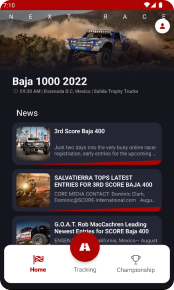

# AdrenalinBaja - React Native App

## Description

AdrenalinBaja is a mobile application developed in React Native that allows you to stay updated on the latest offroad races taking place in the Baja California region, Mexico. With this application, offroad racing enthusiasts can easily access up-to-date information about events, dates, locations, and much more.

## Screenshot
  

## Features

- **Race News:** View a list of news about offroad races in Baja California.

- **News Details:** Access specific details of each news article and more.

- **Tracking:** Explore the real-time locations of the drivers during a race.

- **Sign up and Login:** Sign up and login system.

## Installation

Make sure you have React Native and Yarn on your machine:
1. Start your emulator or android device
2. Run the following command to install dependencies:

   ```shell
   yarn install
   ```
    ```shell
    yarn android
